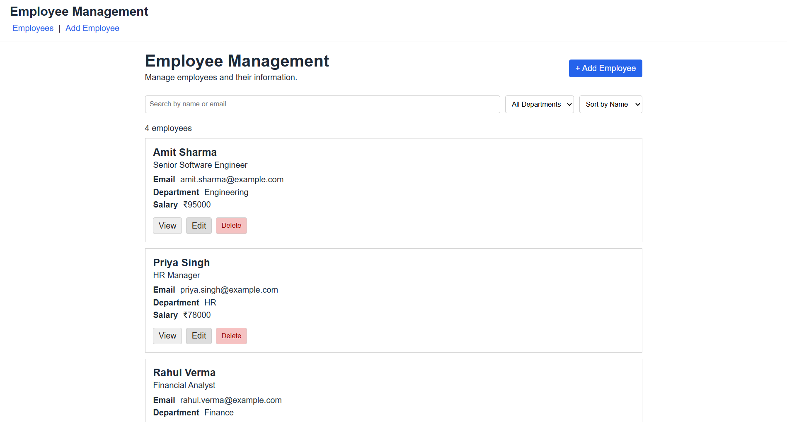
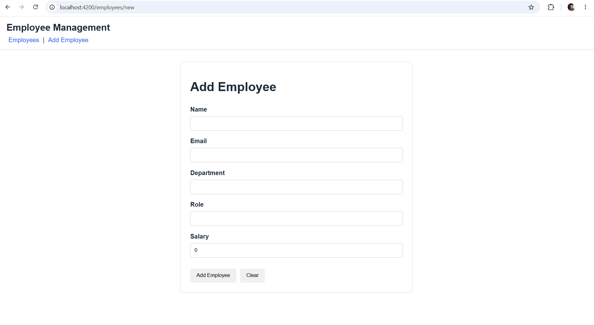
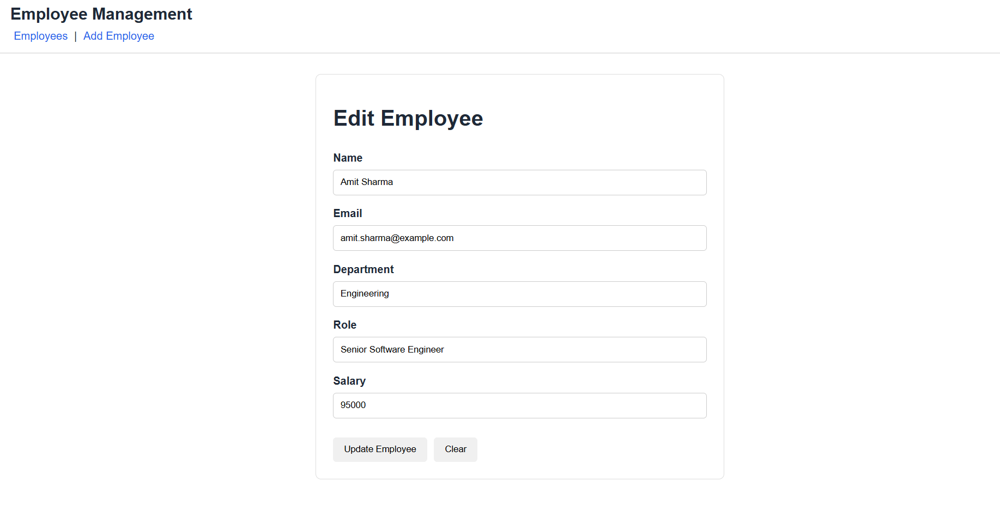
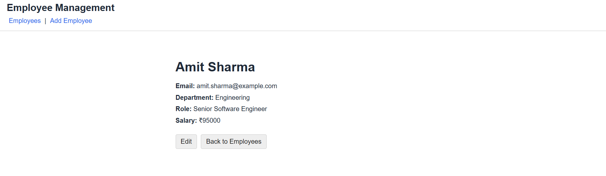
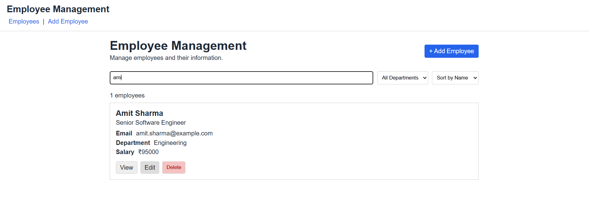

# Employee Management Angular

A simple Employee Management application built with Angular and JSON Server to demonstrate Angular components, services, HttpClient, REST API integration, CRUD operations, forms, validation, routing, and basic responsive UI.

## Use Case

**Employee Management**

The application allows users to view, add, edit, view details, and delete employees.

## Technologies

* Angular 22
* TypeScript
* HTML
* CSS
* Angular Router
* Angular HttpClient
* RxJS
* JSON Server

## Employee Model

Each employee contains:

* ID
* Name
* Email
* Department
* Role
* Salary

## Setup

### 1. Install dependencies

```bash
npm install
```

### 2. Start JSON Server

From the project root:

```bash
npx json-server db.json
```

The API will be available at:

```text
http://localhost:3000
```

### 3. Start Angular application

Open another terminal:

```bash
ng serve
```

Open:

```text
http://localhost:4200
```

## API Endpoints

| Method | Endpoint         | Purpose            |
| ------ | ---------------- | ------------------ |
| GET    | `/employees`     | Get all employees  |
| GET    | `/employees/:id` | Get employee by ID |
| POST   | `/employees`     | Add employee       |
| PUT    | `/employees/:id` | Update employee    |
| DELETE | `/employees/:id` | Delete employee    |

## Application Routes

| Route                 | Description      |
| --------------------- | ---------------- |
| `/employees`          | Employee list    |
| `/employees/new`      | Add employee     |
| `/employees/:id`      | Employee details |
| `/employees/:id/edit` | Edit employee    |

## Features

* Display employees from REST API
* Add employee
* Edit employee
* View employee details
* Delete employee
* Delete confirmation
* Search employees
* Filter employees
* Form validation
* Loading state
* Empty state
* Error message and Retry option
* Responsive layout

## Components

### App

Provides the main application layout and navigation.

### EmployeeList

Displays employees and provides search, filtering, viewing, editing, and deleting functionality.

### EmployeeForm

Used for adding and editing employees with form validation.

### EmployeeDetails

Displays details of a selected employee.

## Service

### EmployeeService

Handles all API communication using Angular `HttpClient`.

The service provides:

* `getEmployees()`
* `getEmployeeById()`
* `addEmployee()`
* `updateEmployee()`
* `deleteEmployee()`

## Angular Concepts Used

* Components
* Interpolation
* Property binding
* Event binding
* Two-way binding
* Angular Router
* Services
* Dependency Injection
* HttpClient
* Observables
* RxJS
* Template-driven/Reactive Forms
* Form validation
* `@if`
* `@for`
* Conditional rendering
* Conditional classes

## Screenshots

### Employee List



### Add Employee



### Edit Employee



### Employee Details



### Search and Filter



## Project Structure

```text
src/
└── app/
    ├── employee-details/
    ├── employee-form/
    ├── employee-list/
    ├── app.config.ts
    ├── app.routes.ts
    ├── employee-service.ts
    └── employee.ts

db.json
```

## Running the Application

Run the following commands in separate terminals:

```bash
npx json-server db.json
```

```bash
ng serve
```

Then open:

```text
http://localhost:4200/employees
```
